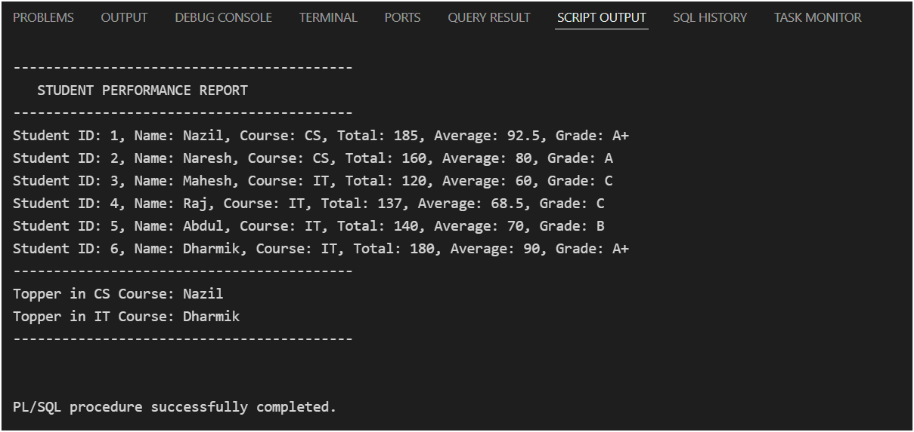
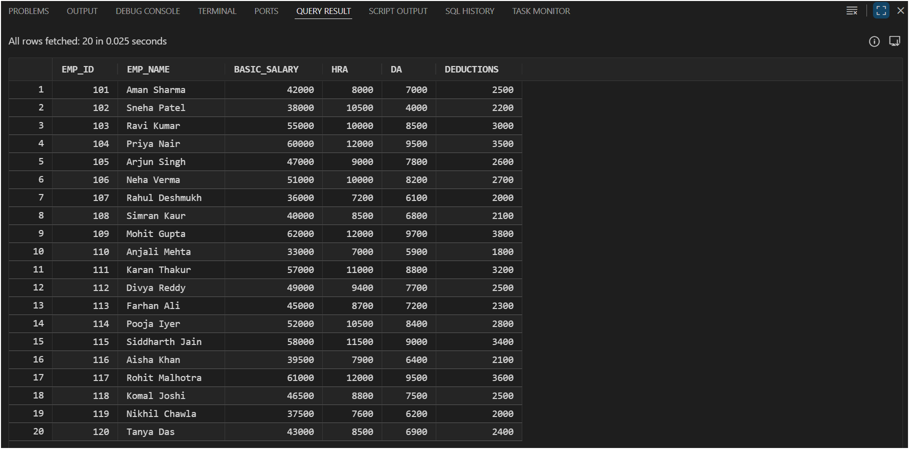
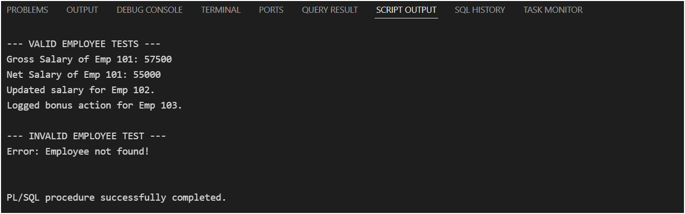
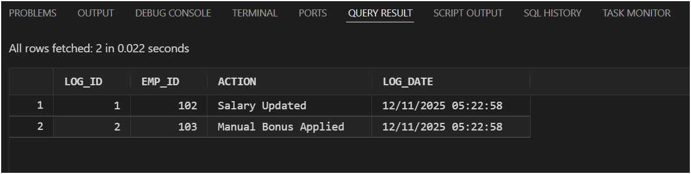

# PL/SQL Training

## 1) Functions in PL/SQL – Student Performance System

- Script Output

- Query Result

## 2) Packages in PL/SQL – Employee Payroll System

- Employees Table Before Update

- Script Output

- Employees Table After Update

- Payroll_log table
