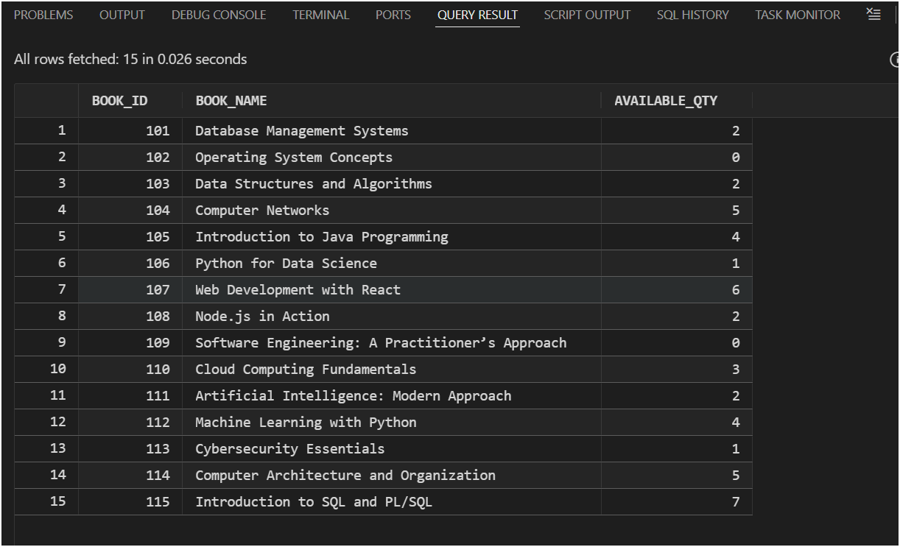
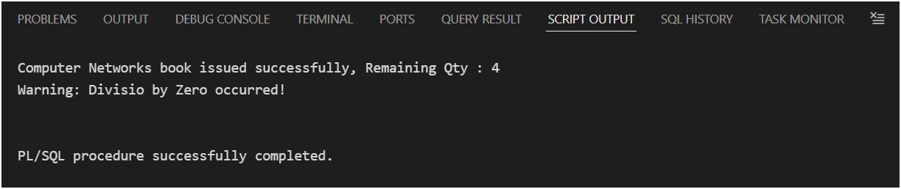
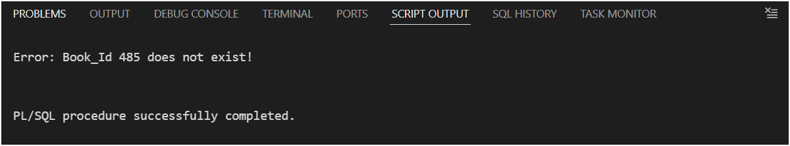
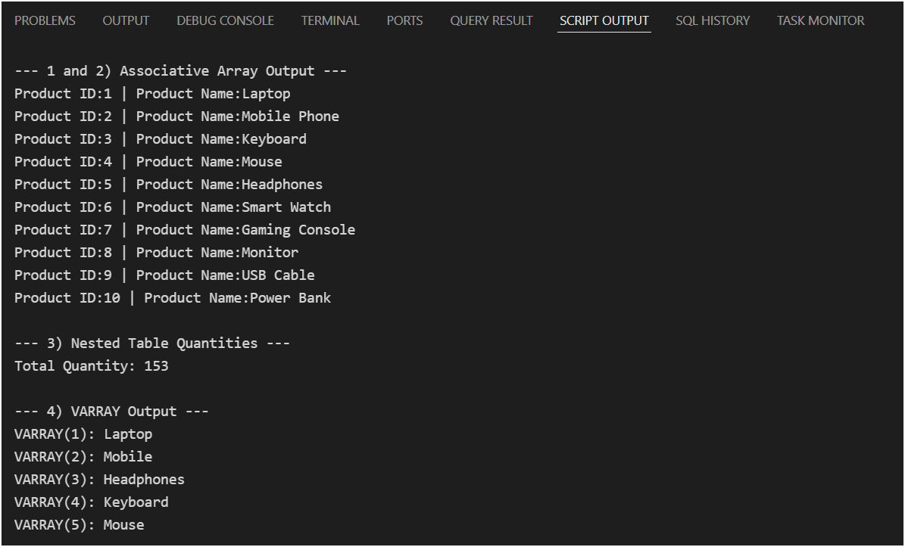
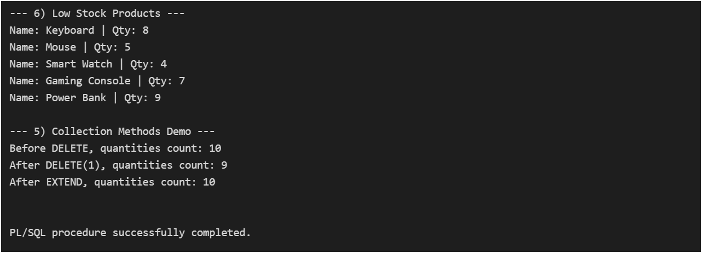
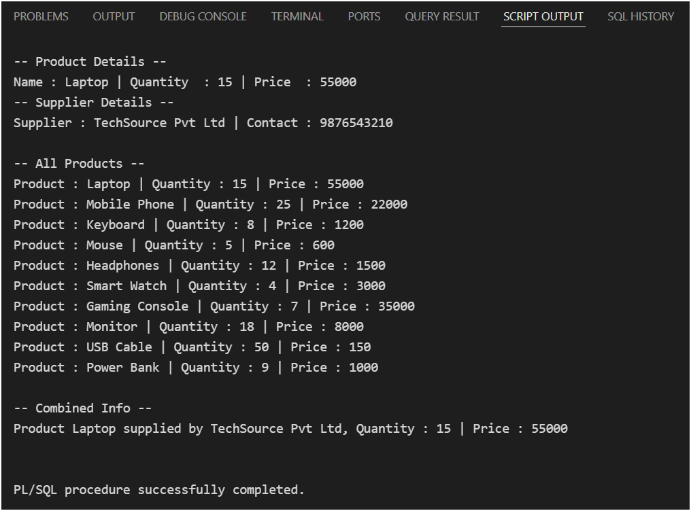
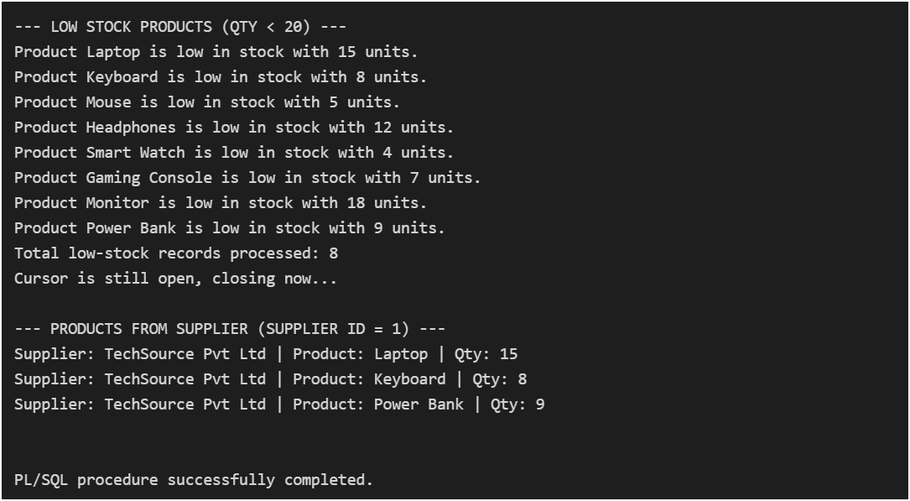

# PL/SQL Training

## 1) Functions in PL/SQL – Student Performance System

- Script Output

- Query Result

## 2) Packages in PL/SQL – Employee Payroll System

- Employees Table Before Update

- Script Output

- Employees Table After Update

- Payroll_log table

## 3) Exception Handling in PL/SQL – Library Book Issue System

- Books Table before issuing the book

- Issuing the book and Divide by zero Exception

- Data not found Exception

## 4) Working with PL/SQL Collections

- Script Output for given subTasks

## 5) Working with PL/SQL Records and %ROWTYPE

- Script OUTPUT

## 6) Working with PL/SQL Cursors

- Script O/P
